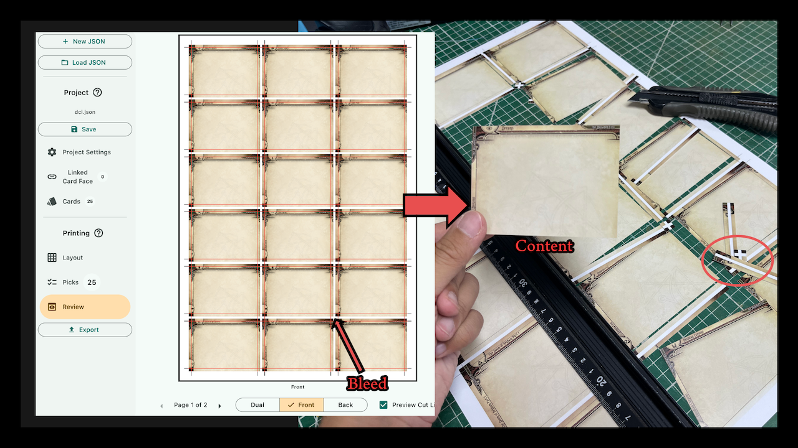

# Homeprint O'Tool

    

Artwork by: <a href="https://www.facebook.com/Sleepy.m.Sloth">Slothy</a>

A desktop software that creates duplex [uncut sheet](https://en.wikipedia.org/wiki/Uncut_currency_sheet) image files out of individual graphics.

Uncut sheet is similar to a contact sheet, but they have shared cut guidelines along the edge. Cutting to these guidelines will take out all the [bleeds](https://en.wikipedia.org/wiki/Bleed_(printing)) of each graphics at the same time, including on their back face, left you with only the intended content area.

In this program, you define the bleed area of each graphic inversely by specifying their content area (the part you want), and they don't need to have the same amount of bleed. It will make sure the shared cut guidelines slice through however much bleed each graphic has.

You can use this program to lay out anything of the same size, like single-sided photo printing, but it was originally designed to print card game graphics with different backsides. In the documentation, each object on the page is referred to as a "card."

It only creates `.png` files of the front side and backside of the uncut sheets. If you need them in other formats like `.pdf`, you must process them further in other programs on your own.

Not only for home printing, you can use the output to negotiate with non-specialized print shops around you to work on jobs that they are normally not willing to. Anything not as simple as business cards printing comes with complexity, tedium, and error-prone nature of layout work. Now you can do that part of the work at your own leisure and might even get discounts because they now only need to print and cut the work.

## Download

    

Get the executable in GitHub's built-in Releases page: https://github.com/5argon/homeprint-o-tool/releases. There should be zip files for Windows and macOS inside each version release.

## Walkthrough

- [General Walkthrough](documentation/walkthrough.md)
- [Special Walkthrough for Arkham Horror: The Card Game players](/documentation/ahlcg/ahlcg.md)

## Developing

If you would like to contribute to this project, go into `flutter` folder and follow [getting started](https://docs.flutter.dev/get-started) guide on the official website. Known issues that need working on are posted in the Issues section.

Note that to build an executable, you will not be able to do so from a different OS than the target. On Windows, it requires Visual Studio 2022 Community with Desktop development C++ module and the Windows 11 SDK checked. On macOS, you need XCode installed. I currently use two machines to create a release each time. You can contribute even if you have only one of the machines, I'll test it on the other.
