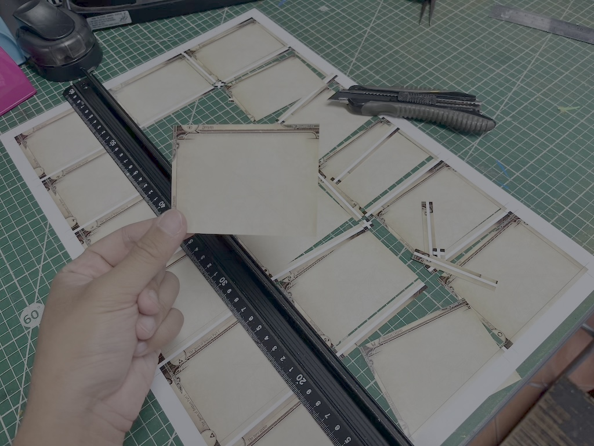

# Homeprint O'Tool

    

Artwork by: <a href="https://www.facebook.com/Sleepy.m.Sloth">Slothy</a>

A desktop software that creates duplex [uncut sheet](https://en.wikipedia.org/wiki/Uncut_currency_sheet) image files out of individual graphics.

Uncut sheet is similar to a contact sheet, but they have cut guidelines along the edge, and the graphic has a [bleed area](https://en.wikipedia.org/wiki/Bleed_(printing)) extending outside its intended content area to account for duplex printing misalignment or cutting errors. You define the bleed area of each graphics inversely by their content area instead (specify the part you want).

Though you can use this program to lay out anything you like, such as photos that you don't need to care about the backside at all, it is originally designed to print card game graphics. From this point on I'll refer to each artwork on the page as a card, and the front and back graphics of the card are "front face" and "back face" respectively.

It only creates `.png` files of the front side and backside of the uncut sheets. If you need them in other formats like `.pdf`, you must process them further in other programs on your own.

Not only for home printing, you can use the output to negotiate with non-specialized print shops around you to work on jobs that they are normally not willing to. Anything not as simple as business cards printing comes with complexity, tedium, and error-prone nature of layout work. Now you can do that part of the work at your own leisure and might even get discounts because they now only need to print and cut the work.

## Walkthrough

- [General Walkthrough](documentation/walkthrough.md)
- [Special Walkthrough for Arkham Horror: The Card Game players](/documentation/ahlcg/ahlcg.md)

## Project

If you would like to contribute to this project, go into `flutter` folder and follow [getting started](https://docs.flutter.dev/get-started) guide on the official website. Known issues that needs working on are posted in the Issues section.

Note that to build an executable, you will not able to do so from different OS than the target. On Windows, it requires Visual Studio 2022 Community with Desktop development C++ module and the Windows 11 SDK checked. On macOS, you need XCode installed. I currently uses two machines to create a release each time. You can contribute even if you have only one of the machine, I'll test on the other.
