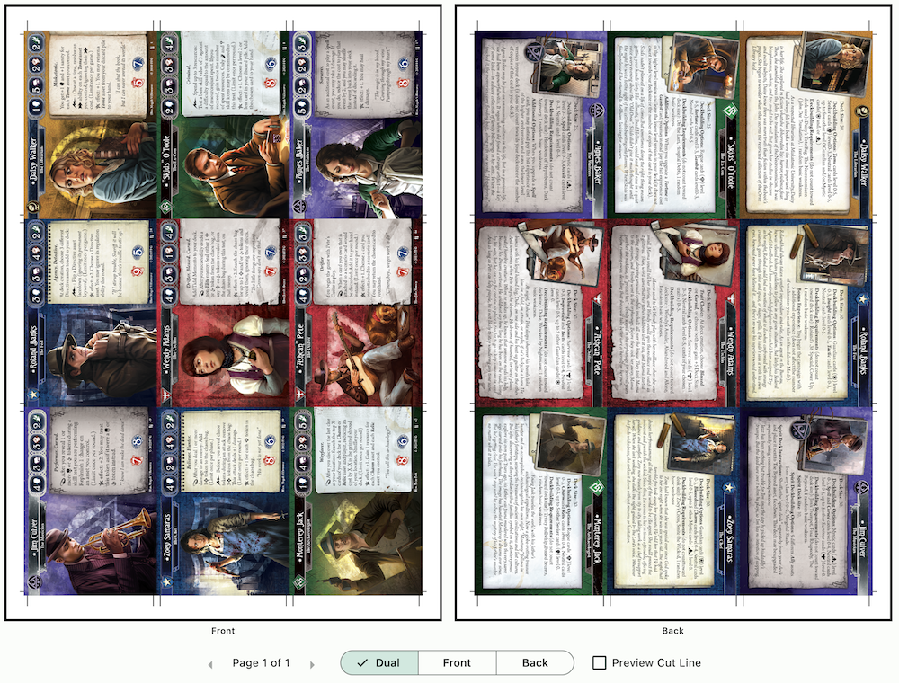

# Special Walkthrough for Arkham Horror: The Card Game players

This was an app originally created for the need to get abundance of custom contents of Arkham Horror: The Card Game (AHLCG) game (both official print-and-play contents and fan-made) printed where I don't have to order popular services like [MPC](https://www.makeplayingcards.com) and paid steep transit and import prices, and instead utilize local print shops where they have excellent printer yet don't know a thing about card games, and so not willing to print anything besides bulk credit cards. Some features in this program specifically addresses problems around this game.

You should still read the [regular walkthrough](./walkthrough.md) first. This special walkthrough expands on it with some pre-made project files that print some of the most desirable custom content for this game. You can learn tricks from these examples before you create your own project.

## Parallel Investigators

- [**Parallel Investigators**](https://www.fantasyflightgames.com/en/news/2020/5/5/beyond-our-dimension/)

Fantasy Flight Games has been releasing extra printable contents for free since 2020 to enrich your purchase of the game. They are in a format of PDF with one card per page. If you specify the page size as the card's size in printing program you might be able to get OK result, but most shop wants not an exact card size but also wanted bleed graphics. It is also a hassle to print multiple PDFs at the same time while having cards in the next PDF continues right from the last card in the previous PDF.

Since then, some fans have been extracting these PDFs into individual `.png` files, even with card bleed extended to be more ready to be sent to professional printing, named/organized systematically and nicely. This organizing format is perfect for this program.

It's perfect to be the first walkthrough too because of low amount of cards in each set, and if one only print the investigator card front/back, they don't have to worry about their printer quality because they don't have to be shuffled into official cards. Maybe you can try picking just the investigator card of 9 parallel investigators to fill up an entire A4 page to test this program.

For this walkthrough we'll use [this coldtoes's extended bleed edits of the official PDF files](https://drive.google.com/drive/folders/1TmniKONBPpFztFcgtW4nFIOYw2QcHR2B?usp=share_link). Please download the entire "Parallels & Challenge Scenarios" folder first. While you can rename the downloaded folder, do not rename any folders inside, since we will be placing our `.json` project file that has relative paths to stuff inside those.

Next, download this sample `.json` project file and place it inside the folder. Open the program and press "Load JSON" to load that file. There are a few neat things that I've set up in this project.

The inside of downloaded sub-folders commonly has "back.png" to be used as the back of most single sided cards. For challenge scenarios, the encounter card back is paired per-card on their "-b" back side graphic.

This project changes things up a bit. In the "Linked Card Face" page you'll notice 2 pre-defined faces : The common back face of player card and encounter card. Every cards that are supposed to use player card back all references to the symbol that uses `01 Daisy Walker - Read or Die/back.png`, and every cards that are supposed to use encounter card back all references to an another symbol that uses `01 Daisy Walker - Read or Die/007 Namer of the Dead-b.png`.

The end result should not matter in most cases because every copy of `back.png` that coldtoes provided are the same, but when you starts needing to color-match the card back to be as close to the FFG-printed card as possible, with how I've set them up, you only have to save your color edits to `01 Daisy Walker - Read or Die/back.png` and `01 Daisy Walker - Read or Die/007 Namer of the Dead-b.png` for it to reflects everywhere, even outside of `01 Daisy Walker - Read or Die` folder. (This just happened to be the first parallel released, so I choose this one.)

The next neat thing I want to point out is that some set of parallel investigator release contains a "Challenge Scenario" side story of that investigator as a part of the set. But from my previous interactions with gaming friends, most wants only the player cards and not the scenario to save printing cost or just that they aren't likely to be played.

I've made picking only the player cards easier with the grouping feature. The contents inside `01 Daisy Walker - Read or Die` is separated into 2 groups when viewed inside the program, so you can pick just Daisy and her signature cards, or the Read or Die Challenge Scenario.

If you want just the Daisy Walker investigator card and not even her signature cards, you can use individual picking button inside the group instead of picking by group. Repeat for other groups, you can output an uncut sheet page consisting of just the investigator cards!

The Picks tab having quantity has a debugger that displays spaces left in your last page, along with quantity of cards for each set. Supposed that you picked everything you want and you see "3 Cards Left" displayed, you know exactly you can sneak in an extra set of Zoey Samaras in there, but you cannot add Jim Culver which requires 5 cards without spawning a new page.

## Dark Matter Campaign

- [**Dark Matter Campaign**](https://mysteriouschanting.wordpress.com/2020/10/17/dark-matter-campaign/)

This is a highly-regarded fan-made full campaign. It was released in a 2.5 GB zipped file consisting of a folder of individual card images, and also a pre-packed A4 sized uncut sheets with cutting guide along the edges, just like what you can get from this program.

While the inclusion of uncut sheets is very well thought out of the author, this app still has something to do with them.

Maybe you want the uncut sheet of different paper size for getting cheaper print cost or less number of cuts, if the print shop can handle larger page like A3. Maybe you want to perform color matching of the player / encounter card back at once place and have it applied to an entire project through this program's symbol feature. Also, the project was made with Strange Eons which at that time has quite a pixellated card templates. With this program's symbol feature, they have been replaced with higher quality one throughout the project. The front side remains as the author distributed.