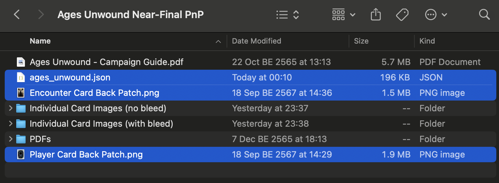

# Ages Unwound Campaign

A fan-made campaign by Olivia Juliet.

- [**Ages Unwound Project Page**](https://mysteriouschanting.wordpress.com/2021/11/10/ages-unwound-campaign/)

The downloaded project structure is the same as the [Dark Matter campaign](dark-matter.md). I also patched in the player and encounter card back the same way, so I'll avoid repeating myself and just provide you all these files. Refer to the [Dark Matter page](dark-matter.md) if you need more details how this works.

- [Project File](project/ages_unwound.json)
- [Player Card Back Patch](project/patch/Player%20Card%20Back%20Patch.png)
- [Encounter Card Back Patch](project/patch/Encounter%20Card%20Back%20Patch.png)

The downloaded folder should look like this before you open the project.

There is a slight technical difficulty in the downloaded files: the act/agenda cards are horizontal and don't agree with the rest of the project! Luckily, this program is capable of soft-rotating them before laying out without you having to go in and rotate the files yourself. (As maybe the case if you are sending these files to services such as MPC for printing.)