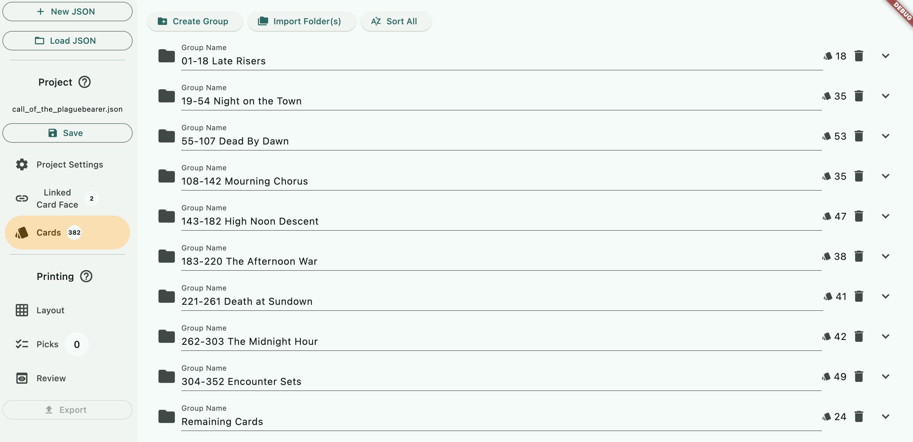

# Call of the Plaguebearer Campaign

A fan-made campaign by Dr. Jack Science.

- [**Call of the Plaguebearer Project Page**](https://mysteriouschanting.wordpress.com/2021/04/06/call-of-the-plaguebearer/)

When I tried to download the project in the provided Google Drive link, it seems to not able to download the entire folder, but I could download just the `Campaign with Bleed` folder inside. If you had the same problem, downloading just `Campaign with Bleed` is fine since that is all the JSON project file will use. Create a new folder to put `Campaign with Bleed` inside, and place these files beside it. The patching card backs is the same approach as what we did with the [Dark Matter](dark-matter.md) and [Ages Unwound](ages-unwound.md) projects.

- [Project File](project/call_of_the_plaguebearer.json)
- [Player Card Back Patch](project/patch/Player%20Card%20Back%20Patch.png)
- [Encounter Card Back Patch](project/patch/Encounter%20Card%20Back%20Patch.png)

There is no structure of folders inside `Campaign with Bleed`, just massive 764 graphic files. With the "Import from Files" feature that is available inside a group, I was able to import a subset of files in the same encounter set, categorizing them into more logical groupings for you to browse easier.

