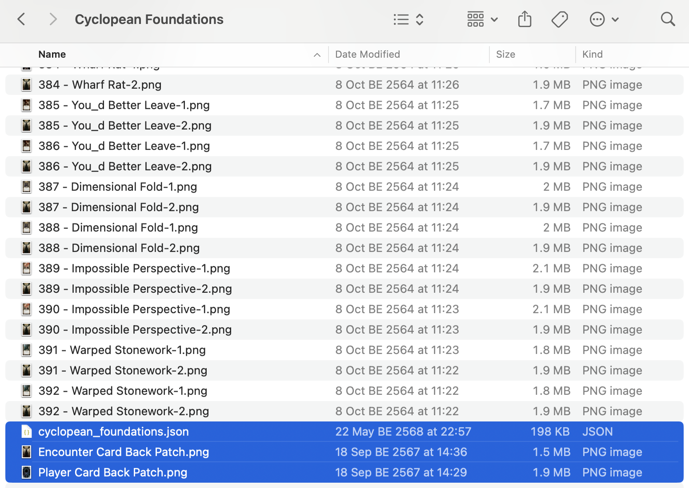

# Cyclopean Foundations

A fan-made campaign by The Beard.

- [**Cyclopean Foundations Project Page**](https://mysteriouschanting.wordpress.com/2021/05/29/cyclopean-foundations-campaign/)

This final example project is similar to [Call of the Plaguebearer](call-of-the-plaguebearer.md). That project has one level of buffer folder `Campaign with Bleed` inside the downloaded folder, and we were able to place the project's JSON file, along with the player/encounter card patch next to that folder. The JSON file has relative paths starting with `Campaign with Bleed/` to dig inside.

However, the downloaded Cyclopean Foundations folder is immediately all the cards. We have no choice but to throw in the JSON project file, and the player/encounter card patching graphic, alongside all these 784 image files.

- [Project File](project/cyclopean_foundations.json)
- [Player Card Back Patch](project/patch/Player%20Card%20Back%20Patch.png)
- [Encounter Card Back Patch](project/patch/Encounter%20Card%20Back%20Patch.png)

This should be what it looks like before you open the project. The difference from "Call of the Plaguebearer" is that the JSON file has relative paths that refer to the images directly, and therefore JSON must be on the same level of all the images.

