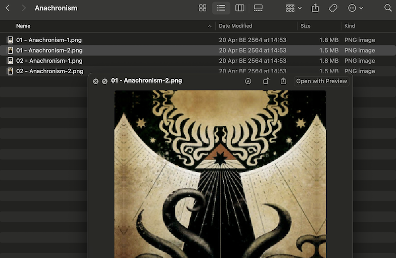
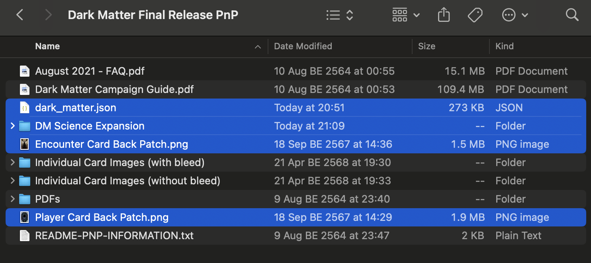
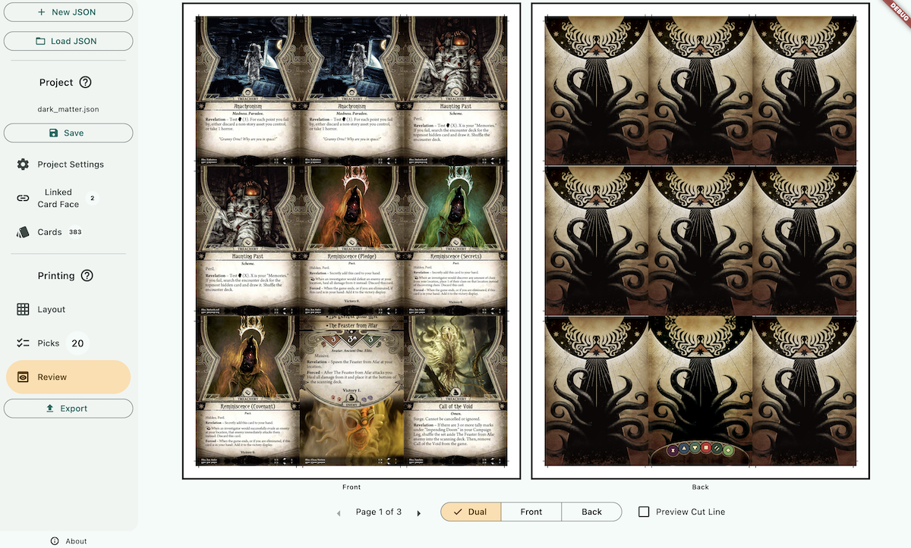

# Dark Matter Campaign

- [**Dark Matter Campaign**](https://mysteriouschanting.wordpress.com/2020/10/17/dark-matter-campaign/)

This is a highly regarded fan-made full campaign. It was released as a 2.5 GB zipped file consisting of a folder of individual card images, and also pre-packed A4-sized uncut sheet PDFs with cutting guides along the edges, just like what you can get from this program.

While the inclusion of uncut sheet PDFs is well-thought-out by the author, they don't have bleeds. You may want to print the campaign in a larger paper that your print shop can handle to save cost. We can use this program to remake the uncut sheets from individual graphics with bleed that the author provided.

Also, the project was made with Strange Eons, which at that time has quite pixelated card templates. I can fix that as much as I can by using the Linked Card Face feature and linking all the player and encounter cards back to an official graphic distributed as a part of print-and-play cards instead. (This campaign, however, also uses something called "scan" encounter card back, and they are not fixed as a part of this effort.)

Download the original Dark Matter project from the official link above. Then download this project file and place the file inside the folder. 

- [Project File](https://drive.google.com/file/d/1r0a2g3q4vXk5x7J6Z8j9l4z5e5e5e5e/view?usp=sharing)

This project file contains relative paths starting with `Individual Card Images (with bleed)/` so it does not matter if you rename the outer folder, as long as you don't rename the inner folder.

If you open the project now, you will see a missing card indicator on the Linked Card Face tab. I mentioned I patched in higher resolution card backs. You need to separately download these files and place them **next to** the project's JSON file. 

- [Player Card Back Patch](https://drive.google.com/file/d/1r0a2g3q4vXk5x7J6Z8j9l4z5e5e5e5e/view?usp=sharing)
- [Encounter Card Back Patch](https://drive.google.com/file/d/1r0a2g3q4vXk5x7J6Z8j9l4z5e5e5e5e/view?usp=sharing)

But wait, Dark Matter has its own expansion called the Science Expansion. So I think why not combine these into the same project as well. Go download the expansion here.

- [Dark Matter – Science Expansion](https://mysteriouschanting.wordpress.com/2022/10/29/dark-matter-science-expansion/)

You should have a folder named `DM Science Expansion`. Put this folder inside the original Dark Matter folder, on the same level as the project JSON file. I have set up the project to refer to things inside this `DM Science Expansion/` folder so please do not rename it.

In summary, the downloaded Dark Matter folder should now look like this, with three additional files and one additional folder :

When you open the project, you should see no missing card indicators on the sidebar where it says 2 Linked Card Face and 383 Cards. You can now go into the Picks tab and pick the cards you want to print. We have successfully repacked the uncut sheets with improved card backs.

