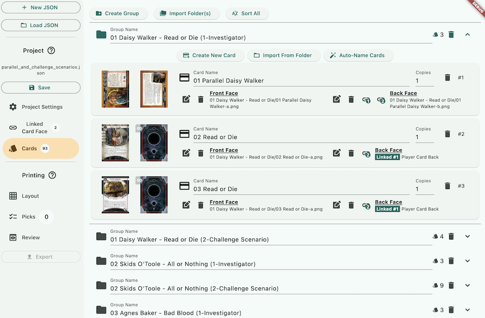
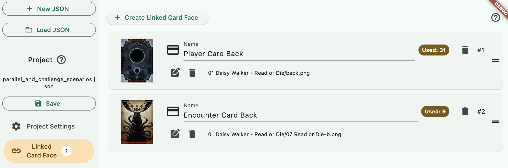
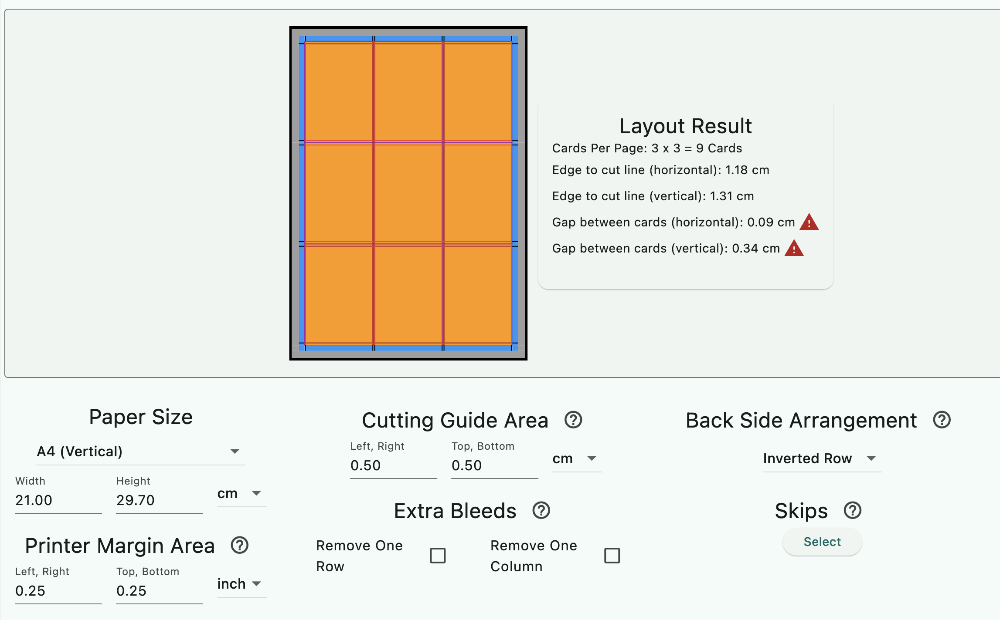
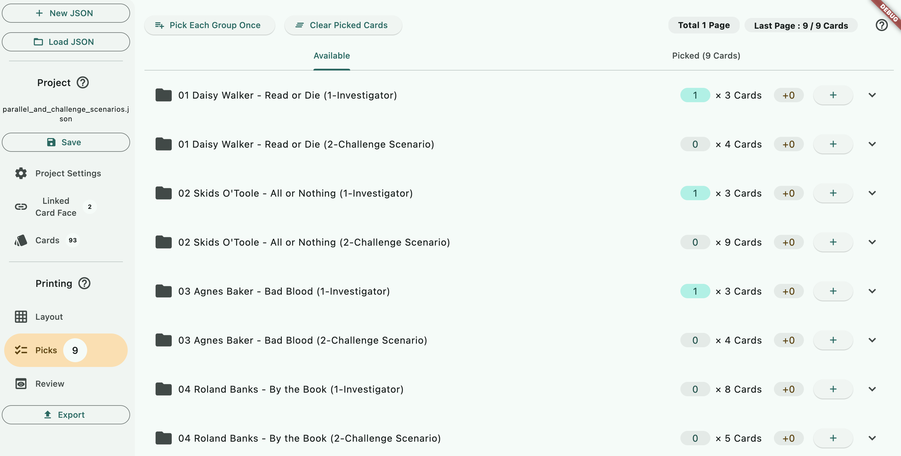
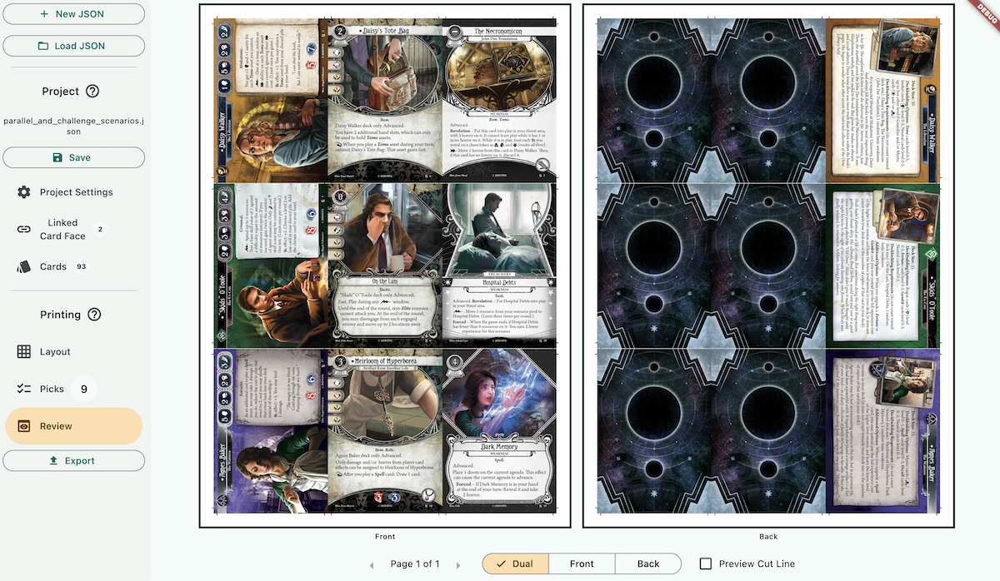
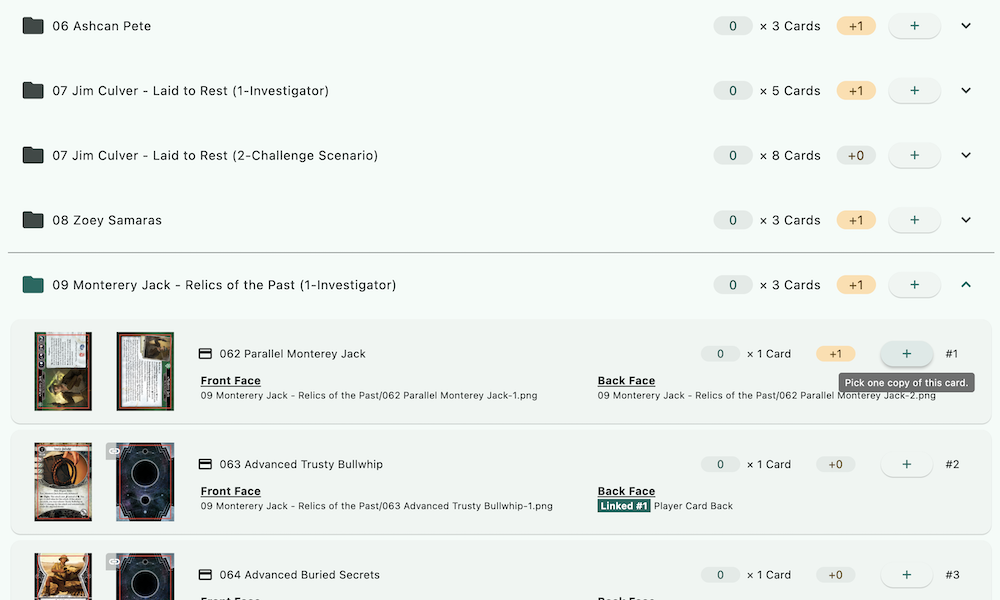
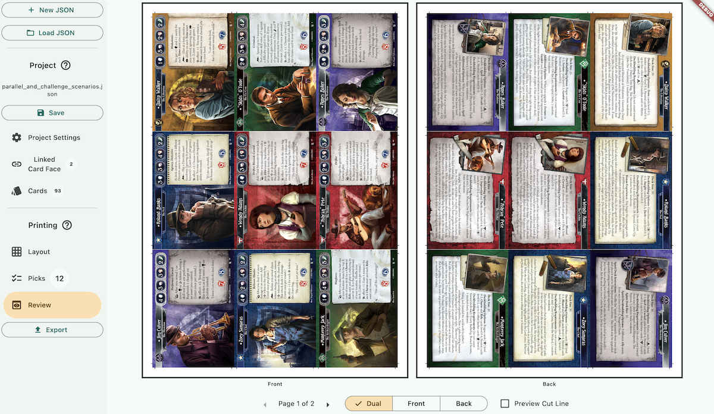
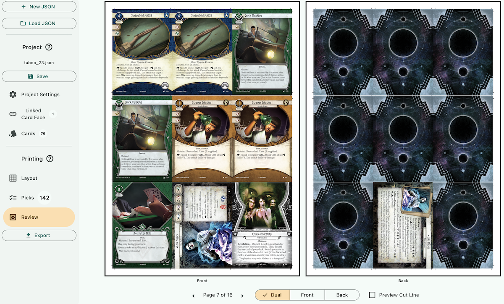

# Official Print-and-Play Contents

Fantasy Flight Games has been releasing extra printable content for free since 2020 to enrich your purchase of the game. Such as [Parallel Investigators](https://www.fantasyflightgames.com/en/news/2020/5/5/beyond-our-dimension/) or [printable Taboo-modified cards](https://www.fantasyflightgames.com/en/products/arkham-horror-the-card-game/) (look inside the FAQ section).

They are in a format of PDFs with one card per page. If you specify the page size as the card's size in the printing program, you might be able to get an OK result, but most shops want not an exact card size but also bleed graphics. It is also a hassle to print multiple PDFs at the same time while having cards in the next PDF continues right from the last card in the previous PDF.

Since then, some fans have been extracting these PDFs into individual `.png` files, even with card bleed extended to be more ready to be sent to professional printing, named/organized systematically and nicely. This organizing format is perfect for this program.

## Table of Contents

- [Parallel Investigators](#parallel-investigators)
- [Taboo](#taboo)

There are others, such as the Play-and-Share Promo, or The Blob that Ate Everything ELSE!. You can follow the approach of the above example projects to print them.

## Parallel Investigators

For this walkthrough, we'll use [this coldtoes's extended bleed edits of the official PDF files](https://drive.google.com/drive/folders/1TmniKONBPpFztFcgtW4nFIOYw2QcHR2B?usp=share_link).

Download the entire "Parallels & Challenge Scenarios" folder. While you can rename the downloaded folder, do not rename any folders inside.  Next, download this `.json` project file and place it **inside** the folder.

- [Download the Project File]()

Open the program and press "Load JSON" to load that file. There are a few neat things that I've set up in this project.

- The card size is not the standard MTG size 6.30 x 8.80 cm, but the strange AHLCG size 6.15 x 8.80 cm.
- The groups you see are not mapping 1-to-1, if any parallel set has a challenge scenario, they have been split into 2 groups so you can pick just the group with player cards if you are not interested in playing the Challenge Scenarios.
- All cards that are supposed to use player/encounter card back are all using the Linked Card Face feature.
- In the Linked Card Face, `01 Daisy Walker - Read or Die/back.png` and `01 Daisy Walker - Read or Die/007 Namer of the Dead-b.png` are used. Therefore, even in later parallel releases, they all use the card back from the first Daisy Walker set. If you would like to color-match the card backs to counter your printer's deficiencies, you can do it in one place and have it applied to all cards that are linked to this card face.

Onto the Layout tab. The simulation reveals that if we use A4 paper and keep the typical printer margin of 1/4 inch, it can be quite challenging to cut. (Notice the red warning icons.) What you can do while not giving up 9 cards per page is reducing the Cutting Guide Area. Personally, I can cut the work even with a tiny black line, so I set it to 0.1 cm to give every card more bleed area.

Now let me demonstrate the ease of picking things to print when we organize the project this way. If you don't care about the Challenge Scenarios, you can fit three parallel investigator sets in one A4 page since each early set happened to contain three cards per set. Go ahead and press the + button on just those Investigator groups.

While you pick, the information in the upper right corner tells you how many cards are left in the last page currently. It is helpful when you start picking a set no longer lining up with our nine cards per page capacity, like the Roland Banks set with eight cards to print.

If one just wants the investigator card and not any Advanced signature cards, they can expand the group and use the inner + button to pick just those cards. Perhaps they are not confident in their printer's ability to make a satisfactory card back that could be shuffled with official cards. Notice that the quantity indicator on the group banner appears differently from when you pick the whole group.

It is also common in group orders where each player has different things they want. You can click the pick button exactly as everyone wanted and send all the output files to the print shop, asking them to print each page once. This strategy might produce a lot of unique pages, though. Alternatively, you can plan out each page carefully with the sequential picking such that you can order a different number of copies for each page to satisfy everyone's needs.

Remember to print some spares if you are planning to cut them yourself, so any cutting mistakes can be fixed with the spares instead of reprinting.

## Taboo

Same as the Parallel Investigators, [coldtoes also have made bleed-extended card graphics of the taboo here](https://drive.google.com/drive/folders/1SDoCdT3-b76YQux0KVjHepRFuFKBBOg5). For this example, I've made a project targeting the `Taboo 2.3 2024 Oct 24`. It is constantly changing each year, so if you are reading this when a newer Taboo list has been released, you might have to create a new project file for it.

- [Download the Project File]()

Put the project JSON file inside the taboo folder. You know the drill by now. Except in this project each card has a quantity higher than 1 assigned. Picking a group will usually add two copies of each card.

The downloaded folder comes with `_playerback.png`, a perfect target to be made into Linked Card Face that almost every card shares.

I'd like to share one neat trick about this project. Personally, I don't like printing Taboo cards, but rather wanted to "patch" my official cards with a new front, therefore keeping my genuine FFG quality card backs. Plus, I can remove the patch when Taboo changes the next year. I'd print the Taboo front on thinner paper and with Card Size slightly smaller than the actual card size. Then I can sandwich them inside the card sleeve without worrying about it showing on the edge when looking from the back.
 
It is easy to modify this project to do that. First, I would reduce the Card Size in the Project section 2 mm from both width and height so the overlay patch is positioned 1 mm from each side. (AHLCG card size was 6.15 cm x 8.80 cm, now it became 5.95 cm x 8.60 cm). Then check "Front Side Only" in the Export Settings dialog.