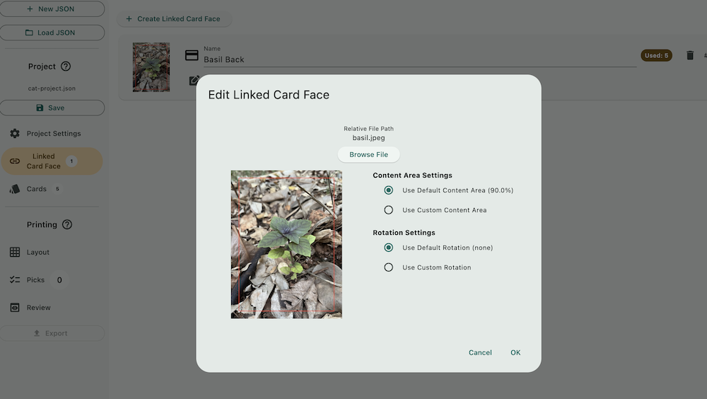

# Project Creation Walkthrough

In this example we'll create a project that prints cat cards where each one has the same back face as a picture of basil plant. 

Before creating a project file, collect all the graphics you need in one folder. This is important as project file links to them with a relative path. Press "New JSON" button and choose a place where the graphics are, or are in inner nested folders.

## Project Settings

You will be directed to the first tab of Project section, the Project Settings. Setting card size should be the first thing you do since an uncut sheet naturally must share the same cut lines that runs along the edge, and cannot have differently sized cards on one page. This affects almost all other calculations.

### Content Area & Default Content Area

One of the reason I made this program is I want the ease of specifying the part of graphic I want and push the rest of the graphic out as bleeds. This is called "content area" in this program.

It is in percentage as this program supports laying out graphics of different resolution or even different aspect ratios and normalize them all to a common Card Size that you had setup above. 

100% means an imaginary rectangle with aspect ratio of Card Size is placed at the center of the graphic, then enlarge it until one of the edge of that rectangle hits one of the edge of the graphics. This is the part you keep. The rest of the graphics are bleeds that you are going to cut out. If percentage number is lower, then it enlarges less than that by that amount of percentage.

Because this rectangle is **always placed at the center**, though you can use variety of aspect ratio and dimensions of graphics with this program, the subject should be relatively centered on the graphic.

The "Default Content Area" **is shared**. Updating the Default Content Area later will also update every cards that are using Default Content Area, so it is not just a default starting value, it is a linked value.

## Linked Card Face

In the next "Card" tab you can create a card, which consists of front face and back face. However, because we are going to use the same basil graphic as the back face of every cards, we can create a predefined common card face to use as the back.

The Default Content Area in Project Settings can be used here. I've set it to 90%, and you can see that 10% of the graphics are marked out of the red line as bleed area to be cut away.

Linked Card Face is great when you want to change the back face to something else later, or even just tune its content area percentage. It'll reflect the changes to all cards that are "linking" to the Linked Card Face.

It is very important in the context of printing proxies or custom content in card games. Often the printed at home cards needs to be mixed with official cards, and user may want to color adjust the card backs such that it matches the official one as much as possible, countering any of their printer's deficiencies.

## Cards

A new project comes with one "group" created for you with no card inside. Cards **cannot** be floating outside of a group in this program, so you must have at least one group to create a card. This rule simplifies the printing process where user can pick a something to print in groups, not cards.

For each card, you can individually specify its front and back face.

In this image, the advantage of Default Content Area in percentage is demonstrated. The number was 90%, and though the cat graphic is horizontal, it is able to frame it and left an acceptable bleed area like the basil card back since it scales the Card Size until it touches either edges of the graphic.

The Back Face is then set to **link** to the Linked Card Face we created earlier. There are convenient buttons to instantly link to card face #1 or #2 defined in the Linked Card Face tab. So bring the card face you think you will reuse the most up to those indexes.

## Create multiple cards by importing

In sizable project you will want to use "Import From Folder" feature to create many cards at once, potentially also assigning their back face strategically.

To do this, you must catalog your graphic in folders nicely and name them carefully. The tool contains special rules that extract information from file name, such as which graphic is supposed to be the back face of which, or how many copies should it automatically type in for you. To learn about these features, please read help buttons inside the program.

For this tutorial, we will just select the folder with 5 cat graphics and 1 basil graphic, which wasn't that well-organized to begin with as the program is going to misunderstood the basil as an actual 6th card. But it's fine, we can delete that later and still save a lot of work.

The import dialog will report what it found before you commit to the import. In this case it is going to create 6 cards, and it didn't automatically find any back face for each. (It could do so with a pair of suffixes such as `-front` `-back` `-a` `-b`, again, you can read the details in the help button inside the program.) But I can still use the Missing Back Face Resolution section below so it use the basil Linked Card Face for every cards.

We have created 6 cards in one go with every back face linked to the Linked Card Face, and they are also automatically named from the file's name. The Card Name can be helpful for someone printing from your project. That card with basil as the front face is a mistake because it was stored in the same folder as the rest, I can go ahead and delete it.

They all use Default Content Area after the import, and so I can inspect and adjust any cat that is looking too small in the frame and use a lower percentage of content area just for that one.

## Copies

When user prints your project, they often do so by "picking" the whole group. Picking a group will cause all cards inside it to be pushed into the layout. The copies can be changed so it pushes that card consecutively more times per one pick of the group.

User can also pick any card inside a group individually. That will ignore the Copies settings and always push in 1 copy of that card per pick.

For demonstration purpose of Copies feature in [Project Printing Walkthrough](../print/print.md), I'll set the copies of the mackarel colored cat to 2 and then save the changes into the JSON file.