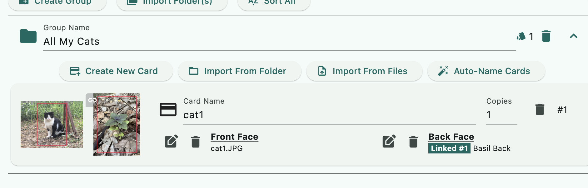

# Project Creation Walkthrough

In this example, we'll create a project that prints cat cards where each one has the same back face as a picture of a basil plant.

Before creating a project file, collect all the graphics you need in one folder. This is important as the project file links to them with a relative path. Press the "New JSON" button and choose a place where the graphics are, or are in inner nested folders.

## Project Settings

You will be directed to the first tab of the Project section, the Project Settings. Setting card size should be the first thing you do since an uncut sheet naturally must share the same cut lines that run along the edge and cannot have differently sized cards on one page. This affects almost all other calculations.

### Content Area

One of the reasons I made this program is I want the ease of specifying the part of the graphic I want and push the rest of the graphic out as bleeds. This is called "content area" in this program.

It is in percentages as this program supports laying out graphics of different resolution or even different aspect ratios and normalizing them all to a common Card Size that you had set up above.

100% means an imaginary rectangle with an aspect ratio of Card Size is placed at the center of the graphic, then enlarge it until one edge of that rectangle hits one edge of the graphics. This is the part you keep. The rest of the graphics are bleeds that you are going to cut out. If the percentage number is lower, then it enlarges less than that by that amount of percentage.

Because this rectangle is **always placed at the center**, though you can use a variety of aspect ratios and dimensions of graphics with this program, the subject should be relatively centered on the graphic.

The "Default Content Area" **is shared**. Updating the Default Content Area later will also update every card that is using Default Content Area, so it is not just a default starting value, it is a linked value.

### Rotation

It is expected that most of the input graphics are of the same aspect ratio as the Card Size settings, or at least in similar shape. But sometimes there are both horizontal and vertical input graphics in one project. Rotation can be applied card-by-card to the minority of graphics that are not matching with the Card Size's shape.

Because rotation is more often applied on a per-card basis, this Default Rotation option should be left as None in most cases, as you can flip the Card Size to match most of the input graphics instead.

## Linked Card Face

In the next "Card" tab you can create a card, which consists of front face and back face. However, because we are going to use the same basil graphic as the back face of every card, we can create a predefined common card face to use as the back.

The Default Content Area in Project Settings can be used here. I've set it to 90%, and you can see that 10% of the graphics are marked out of the red line as bleed area to be cut away.

Linked Card Face is great when you want to change the back face to something else later or even tune its content area percentage. It'll reflect the changes to all cards that are "linking" to the Linked Card Face.

This feature is useful in the context of printing proxies or custom content in card games. Often the printed at home cards need to be mixed with official cards. User may want to color adjust the card backs such that it matches the official one as much as possible, countering any of their printer's deficiencies.

## Cards

A new project comes with one "group" created for you with no card inside. Cards **cannot** be floating outside a group in this program, so you must have at least one group to create a card. This rule simplifies the printing process where user can pick something to print in groups, not cards.

For each card, you can individually specify its front and back face.

In this image, the advantage of Default Content Area in percentage is demonstrated. The number was 90%. Though the cat graphic is horizontal, it is able to frame it and left an acceptable bleed area like the basil card back, since it scales the Card Size until it touches either edge of the graphic.

The Back Face is then set to **link** to the Linked Card Face we created earlier. There are convenient buttons to instantly link to card face #1 or #2 defined in the Linked Card Face tab. So bring the card face you think you will reuse the most up to those indexes.

### Rotation

Graphics are expected to be matching in its shape to Card Size you have set in the project settings, as the content area percentage algorithm works by scaling Card Size-shaped box until it touches the edge as 100%.

However, you might have an input graphics rotated the other way in a project with both vertical and horizontal cards. If you left them as-is, this is the result of applying the content area.

### Create multiple cards by importing

In a sizable project you will want to use the "Import From Folder" feature to create many cards at once, potentially also assigning their back face strategically.

To do this, you must catalog your graphics in folders nicely and name them carefully. The tool contains special rules that extract information from a file name, such as which graphic is supposed to be the back face of which card, or how many copies it should automatically type in for you. To learn about these features, please read help buttons inside the program.

For this tutorial, we will just select the folder with five cat graphics and one basil graphic, which wasn't that well-organized to begin with as the program is going to misunderstand the basil as an actual sixth card. But it's fine, we can delete that later and still save a lot of work.

The import dialog will report what it found before you commit to the import. In this case it is going to create 6 cards, and it didn't automatically find any back faces for each card. (It could do so with a pair of suffixes such as `-front` `-back` `-a` `-b`, again, you can read the details in the help button inside the program.) But I can still use the Missing Back Face Resolution section below so it uses the basil Linked Card Face for every card.

We have created six cards in one go with all back faces linked to the Linked Card Face, and they are also automatically named from the file's name. The Card Name can be helpful for someone printing from your project. That card with basil as the front face is a mistake because it was stored in the same folder as the rest, I can go ahead and delete it.

They all use Default Content Area after the import, and so I can inspect and adjust any cat looking too small in the frame and use a lower percentage of content area just for that one.

### Copies

When a user prints your project, they often do so by "picking" the whole group. Picking a group will cause all cards inside it to be pushed into the layout. The copies can be changed so they push that card consecutively more times per one pick of the group.

Users can also pick any card inside a group individually. That will ignore the Copies settings and always push in one copy of that card per pick.

For demonstration purpose of Copies feature in [Project Printing Walkthrough](../print/print.md), I'll set the copies of the mackerel-colored cat to 2 and then save the changes into the JSON file.
