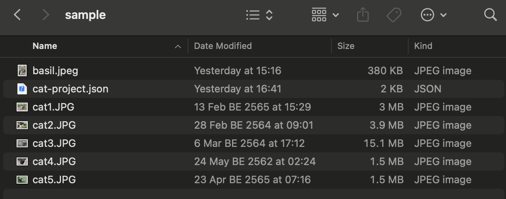
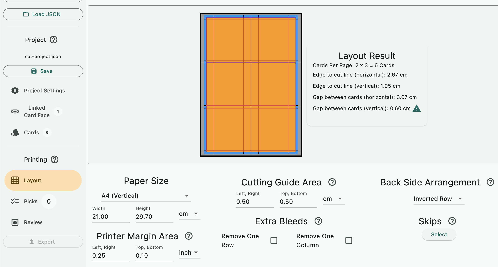
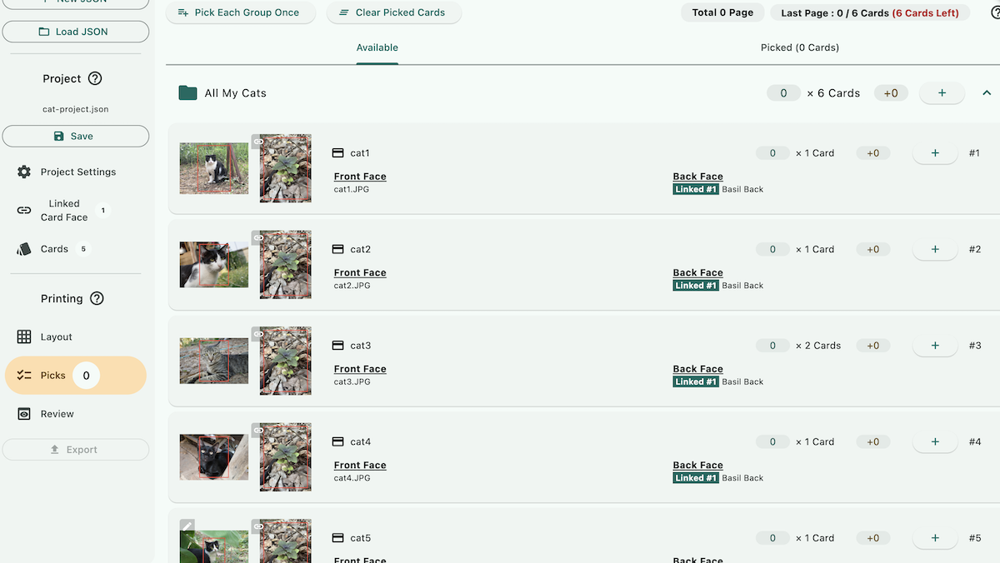
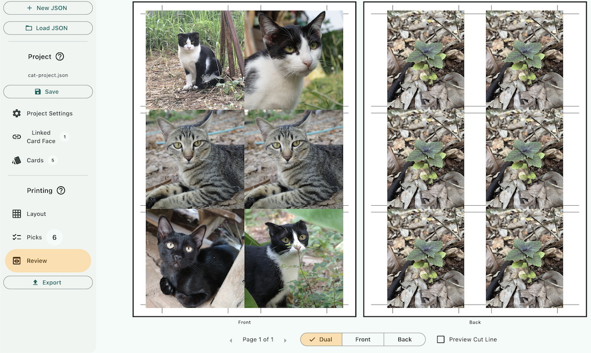

# Project Printing Walkthrough

We will print the project created in [Project Creation Walkthrough](../create/create.md). As a recap, a JSON project file contains relative path to the graphics and other information to assemble them. Project author might distribute a folder containing graphics and a JSON file like this. (Graphics could be nested in inner folders as long as relative path can drill down into them.)

## Layout

The project file specifies the card size. When that combined with project consumer side's printer specs and paper size they would like to use, we now have everything to determine how many cards you can sqeeze in per page, along with a simulation of remaining spaces that it can distribute to cutting guides and bleed area.

This page let you make adjustments to balance amount of cards in the page and comfort of cutting it. By default the program fits as many cards as possible. And as you see here, there is a warning icon at vertical gap between cards that it might be hard to cut with such tiny gap.

What you can do to alleviate this is by using smaller margin (as small as your printer's ability to print close to the edge), sacrificing the length of cutting guide area that runs along the edge (maybe you think you can still cut straight with only a tiny black line?), and if none of those gave you enough room, remove a row or a column from the optimal layout.

Back Side Arrangement is very important for duplex printing. If back face of cards in the project is different, you must learn what your printer is expecting in order for the correct back face to pair up with its front face. The default "Inverted Row" might not be the correct option for you.

Skips feature let you specify a spot on the page that the program will skip over. This feature was created when I discovered that my print shop always print faded color on the bottom edge because the roller in laser that flip the paper can't roll thick paper good enough and it stops receiving color particles at the very last moment. I can mark the whole bottom rows as skips.

## Picks

Now comes the fun part that is picking what to print. You can pick the whole group with the + button on the group, or expand into the group and pick any individual card. Picking a group will respect Copies number of each card inside it that the project author specifies.

In that image, even though there are 5 different cards the counter shows "6 Cards" that will get added per pick because the mackerel cat was specified as 2 copies. This is perfect as the Layout settings earlier reveals that I could fit in 6 cards in a single A4 page.

"Picking" is sequential and can be repeated, if you pick Group A twice, pick Group B once, then pick Group A again once, it is going to laid out graphics exactly in that order. To see the sequence of what you had picked, check out the Picked tab.

A common thing to do is to not waste any space in the final page and put something there as spares. You can use information on the top left to see if you have any space left for more cards as you pick.

## Review

Finally you can see the result of everything. Notice that each card has their own boundary that the bleed can spill on. The input graphic of these cats have much more bleed available than you see here.

On the other hand, the basil graphic on the back side has no more bleed horizontally, so the program paints as much as the graphic has, and left the remaining space exposed to show the underlying cut lines. Cut lines along the edges are enough to make a straight cut, but more lines in-between the graphics doesn't hurt.

Preview Cut Line brings the cut lines on top of the graphics. It might help you spot some cards that need the content area adjusted, perhaps what you don't want to see ended up slightly inside the content area.

## Export

Press the Export button to bring up a dialog where you can adjust the file name and some basic post processing such as rotating the image. My print shop requires a PDF file where odd pages are rotated counter-clockwise, and even pages are rotated clockwise, to pair up duplex printing correctly. 

Printing on the back side at exactly the same spot as the front is hard for the printer, especially for home printer, or even a big laser printer at print shop is not quite at the level of card printers that trading card game factory use (offset printers).

I've talk with print shop before and they said the "alignment module" that tries to line up the paper after rolling it to the back side costs 3000 USD, and even so the back side ended up not lining up perfectly when you look at the resulting print up in the sun. The best you can do is having enough bleed area for everything and hope that the shift is not noticable.