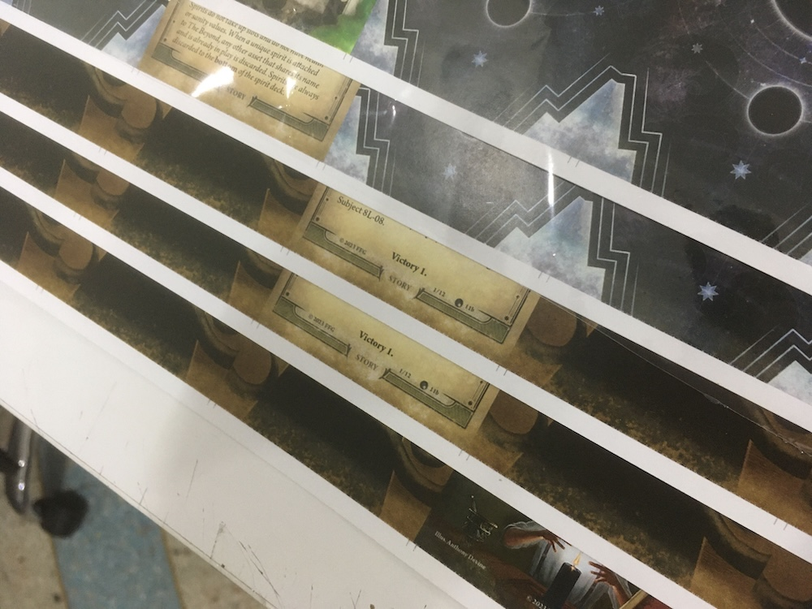
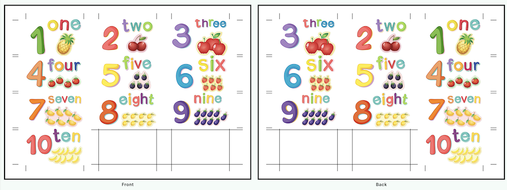

# Project Printing Walkthrough

We will print the project created in [Project Creation Walkthrough](../create/create.md). As a recap, a JSON project file contains relative paths to the graphics and other information to assemble them. Project author might distribute a folder containing graphics and a JSON file like this. (Graphics could be nested in inner folders as long as relative paths can drill down into them.)

## Layout

The project file specifies the card size. When combined with the project consumer side's printer specs and paper size they would like to use, we now have everything to determine how many cards you can squeeze onto per page. Along with a simulation of remaining spaces that it can distribute to cutting guides and bleed area.

This page lets you make adjustments to balance the number of cards on the page versus the comfort of cutting it.

### Making Tradeoffs Between Cards and Cutting Comfort

By default, the program fits as many cards as possible. And as you see here, there is a warning icon at the vertical gap between cards that it might be hard to cut with such a tiny gap.

What you can do to alleviate this is by using a smaller margin. (As small as your printer's ability to print close to the edge.) Sacrificing the length of cutting guide area that runs along the edge. (Maybe you think you can still cut straight with only a tiny black line?) If none of those gave you enough room, use the remove row/column checkbox for a crude yet simple one-click solution.

Margin can be set separately for long and short edges. Laser printer not able to print the bottom edge well when paper is thick is a known problem. It was because the roller in laser that flips the paper can't roll thick paper well enough at the edge, and it stops receiving color particles at the very last moment. It might help to increase the margin only on the short edge where it is going to roll over, even though the printer spec said it could print close to the edge.

### Backside Arrangement

Backside Arrangement is critical for duplex printing where cards might have different back face. You must learn what your printer is expecting (how it rolls over the paper) in order for the correct back face to pair up with its front face. There's a chance default "Inverted Row" might not be the correct option for you, but I do think it is a good default.

At the Export step, there is a final post-processing option that could rotate the rendered front page and back page differently. You also need to factor those in.

For example, my print shop is expecting this exact arrangement in the PDF file that I have to make for them. It must be horizontal too.

But most of the project I make is vertical. The "combo" to get the final result that makes this print shop happy is using the Inverted Row arrangement on the back page. Then in the export post-processing step, the front page should be rotated counter-clockwise, while the back page is rotated clockwise. Please figure out your own "combo" carefully.

### Skips

Skips feature lets you specify a spot on the page that the program will skip over. Using the Invert button there, you can instead specify spots you want the cards to be. This is a niche feature that might sound useless, but I have used it to recycle some wasted white space on the paper that has been used for an entirely different project! For example, the last page of a standard size printing project has leftover space to sneak in much more mini-card sized cards, with some manual image editing effort to merge two projects.

## Picks

Now comes the fun part that is picking what to print. You can pick the whole group with the + button on the group or expand into the group and pick any individual card. Picking a group will respect the Copies number of each card inside it that the project author specifies.

In that image, even though there are five different cards, the counter shows "6 Cards" that will get added per pick because the mackerel cat was specified as two copies. This is perfect as the Layout settings earlier reveal that I could fit in six cards in a single A4 page.

An act of "Picking" is sequential and can be repeated, if you pick Group A twice, pick Group B once, then pick Group A again once, it is going to lay out graphics exactly in that order. To see the sequence of what you had picked, check out the Picked tab.

A common thing to do is to not waste any space in the final page and put something there as spares. You can use information on the top left to see if you have any space left for more cards as you pick.

## Review

Finally, you can see the result of everything. Notice that each card has its own boundary that the bleed can spill on. The input graphics of these cats have much more bleed available than you see here.

On the other hand, the basil graphic on the backside has no more bleed horizontally, so the program paints as much as the graphic has, and left the remaining space exposed to show the underlying cut lines. Cut lines along the edges are enough to make a straight cut, but more lines in-between the graphics don't hurt.

Preview Cut Line brings the cut lines on top of the graphics. It might help you spot some cards that need the content area adjusted, perhaps what you don't want to see ended up slightly inside the content area.

## Export

Press the Export button to bring up a dialog where you can adjust the output file naming, pixel per inch value, and some basic post-processing such as rotating the image. As mentioned, the rotation is quite critical and must work together with Backside Arrangement in the Layout tab to pair the correct backside.

Printing on the backside at exactly the same spot as the front is hard for the printer, especially for home printer. Even a big laser printer at a print shop is not quite at the level of card printers that trading card game factory use (offset printers).

I've talked with a print shop before. They said the "alignment module" that tries to line up the paper after rolling it to the backside is an add-on that costs 3000 USD. Even so, the backside is still not lining up perfectly when you look at the resulting print up in the sun. The best you can do is have enough bleed areas for everything and hope that the shift is not noticeable.
