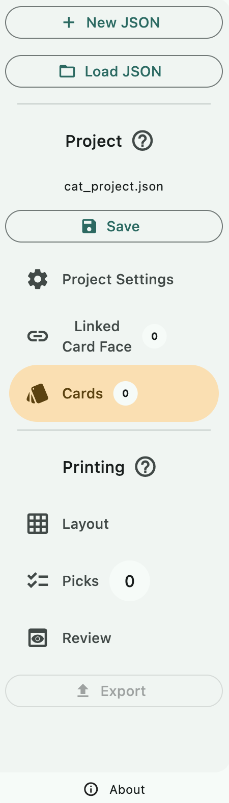

# General Walkthrough

A "project" is a JSON file with **relative paths** from itself to the graphics and other data that assemble those graphics into cards.

Users of this program can either **design** a project (save a JSON file for personal use or distribution) or **print** a project (create uncut sheet images). The sidebar has a separator that divides Project from Printing clearly, because it is important to be aware of what settings could be saved back into the project file and which cannot. 

For example, if you are a project creator, you should not have to care how many cards per page their printer could do, or which subset of cards they are printing. Those settings are in the Printing section and are not saved into the project file.

However, project creators do care that each card's front face pairs up to the correct back face. (But do not care how different printers handle arrangement on the back page to line up the right back face of the cards). Or how many copies of a certain card in a named set that you have defined that is "correct." These settings are in the Project section, and when changed, you can press Save (also in the Project section) to keep the changes. It is expected that most project consumers just wanting to print something will only have to use the Printing section tabs after loading a project JSON that someone else had distributed.

The walkthrough will therefore also be split into two documents:

- [Project Creation Walkthrough](./create/create.md)
- [Project Printing Walkthrough](./print/print.md)
